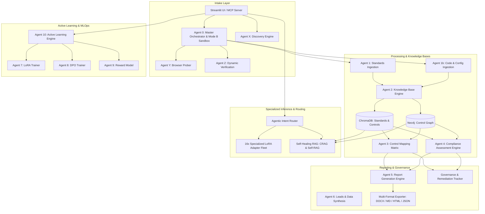

# ComplianceMesh

> Local-first, evidence-grounded compliance engineering for source code, documents, and explicitly authorized staging environments.

ComplianceMesh is an enterprise-grade, multi-agent AI platform built in Python and Streamlit for assessing technical evidence against global cybersecurity, privacy, AI risk, and regulatory frameworks. It unifies structured control registries, deep codebase and configuration analysis, automated dynamic web probing, self-healing retrieval-augmented generation (RAG), cross-framework mapping, a fleet of 16 specialized LoRA adapters, active learning, human-in-the-loop governance, and standardized multi-format reporting in Word (`.docx`), Markdown (`.md`), HTML, JSON, and Plain Text.

It is designed to empower security, engineering, privacy, and GRC teams to prepare audit-ready evidence packages, track remediation (POA&M), and identify posture gaps with high precision. It is **not** a formal certification authority or penetration-testing substitute, but an intelligent decision-support and audit orchestration system.

---

## Contents

- [What it does](#what-it-does)
- [Current project status](#current-project-status)
- [Key capabilities](#key-capabilities)
- [Architecture & Multi-Agent Roster](#architecture--multi-agent-roster)
- [Specialized LoRA Adapters Fleet](#specialized-lora-adapters-fleet)
- [Ingested Knowledge Bases & Vector Stores](#ingested-knowledge-bases--vector-stores)
- [Self-Healing RAG Engine (CRAG & Self-RAG)](#self-healing-rag-engine-crag--self-rag)
- [Structured Control Libraries & Version Registries](#structured-control-libraries--version-registries)
- [Reporting & Multi-Format Export Engine](#reporting--multi-format-export-engine)
- [Repository layout](#repository-layout)
- [Prerequisites](#prerequisites)
- [Installation and quick start](#installation-and-quick-start)
- [Using the web application](#using-the-web-application)
- [Command-line workflows](#command-line-workflows)
- [Dynamic web assessment and credentials](#dynamic-web-assessment-and-credentials)
- [Configuration](#configuration)
- [Data handling and security boundaries](#data-handling-and-security-boundaries)
- [Outputs](#outputs)
- [Testing and quality checks](#testing-and-quality-checks)
- [Known limitations](#known-limitations)
- [Development roadmap](#development-roadmap)
- [Contributing](#contributing)
- [License and responsible use](#license-and-responsible-use)

---

## What it does

ComplianceMesh turns technical evidence and documentary source data into a traceable, automated audit workflow:

1. **Evidence & Document Intake**: Ingests standards documents, policies, architecture diagrams (Mode A), local codebases, container manifests, git repositories (Mode B), or authorized live web endpoints (Dynamic Probing).
2. **Control Normalization & Indexing**: Normalizes framework requirements into versioned structured JSON records, generates vector embeddings into ChromaDB, and maintains relational/semantic graphs via optional Neo4j.
3. **Static Code & Config Inspection**: Analyzes ASTs, regex signals, configuration patterns, hardcoded secrets, cryptographic suites, access-control decorators, and OWASP/CWE-aligned indicators.
4. **Dynamic & Browser-Based Probing**: Leverages Playwright to passively and actively observe runtime security posture (HTTP security headers, cookies, CSP, CORS, storage keys, SSL/TLS, and error disclosures).
5. **Cross-Framework Control Mapping**: Identifies semantic equivalences and overlapping requirements across ingested standards to enable "assess once, comply with many" workflows.
6. **Evidence-Grounded Assessment**: Evaluates controls against ingested evidence with source citations, line references, confidence scoring, and Nemotron/Gemini factual verification.
7. **Specialized LoRA Reasoning**: Automatically routes complex domain questions to 16 fine-tuned PEFT LoRA adapters (Zero Trust, NIST AI RMF, ISO 27001, GDPR, HIPAA, WSTG, etc.).
8. **Standardized Compliance Reporting**: Renders executive-grade audit scorecards, gap analyses, and remediation roadmaps into styled Word (`.docx`), Markdown (`.md`), HTML, JSON, and Plain Text.
9. **Remediation Tracking & Governance**: Tracks finding lifecycle states (Open, In Progress, Closed, Risk Accepted) in a persistent POA&M registry with Human-in-the-Loop review gates and active-learning fine-tuning loops.

---

## Current project status

This repository contains a production-ready, local-first compliance engineering framework. It includes a reactive Streamlit application, an end-to-end multi-agent pipeline (Agents 0 through 10, plus Agents X, Y, Z), a dedicated Model Context Protocol (MCP) server, structured control registries, trained specialized LoRA adapter weights, and verification utilities.

Key operational considerations:
- **Decision-Support Focus**: Reports and findings are audit-readiness assessments; human reviewers validate final attestations.
- **Local-First with Cloud Verifier**: Base generation, vector search, and static analysis execute 100% locally. Real-time verification optionally leverages cloud endpoints (OpenRouter Nemotron / Google Gemini) when configured.
- **Authorized Dynamic Testing**: Dynamic URL and browser probing require explicit operator scope confirmation and contractual authorization.

---

## Key capabilities

### 1. Multi-Modal Evidence Intake
- **Mode A (Documents & Architectures)**: Text and PDF standard ingestion, automated parsing, chunking, and control normalization.
- **Mode B (Codebases & Sandboxes)**: Local repository intake, zip/tar archives, Dockerfiles, Terraform scripts, and remote Git clones.
- **Dynamic Mode (Web & API Probes)**: Live staging environment analysis via Playwright and HTTP request inspection.
- **Multi-Tenant Client Vault**: Isolated client profiles, industry tags, jurisdiction configurations, and uploaded evidence stores.

### 2. Multi-Agent Reasoning Pipeline
- 16 specialized agents executing in sequence and parallel for discovery, extraction, vectorization, cross-mapping, assessment, report generation, lead generation, and continuous training.
- Intent classification router dynamically selecting between RAG search, specialized adapter inference, control mapping, or live audit.

### 3. Domain-Specific LoRA Adapters & MLOps
- 16 high-precision Qwen-based LoRA adapters fine-tuned on specialized compliance corpora.
- Hot-swapping adapter registry with centroid-based semantic intent routing.
- DPO (Direct Preference Optimization), Reward Modeling, and Active Learning feedback loops.

### 4. Enterprise Governance & POA&M Remediation
- Human-in-the-Loop (HITL) expert review gate for pending audit reports.
- Real-time Remediation Tracker synchronizing findings with ticket workflows and CSV/JSON export.
- Audit trail logging capturing operator actions, scope confirmations, and model verification metadata.

### 5. Multi-Format Reporting & Export Engine
- Standardized Word document (`.docx`) template rendering with Jinja2 loop support and professional styling.
- Markdown, HTML, JSON, and Plain Text instant multi-format downloads across both chat popovers and audit panels.

---

## Architecture & Multi-Agent Roster



### Multi-Agent Roster

| Agent / Module | Name | Responsibility |
|---|---|---|
| `agents/agent0_master_orchestrator.py` | Master Orchestrator | Coordinates full pipeline runs, standards ingestion, and multi-agent synthesis. |
| `agents/agent0_mode_b_sandbox.py` | Mode B Sandbox | Manages local repo extraction, Docker/runtime sandboxing, and codebase evidence scanning. |
| `agents/agent_x_discovery.py` | Discovery Agent | Scans target infrastructure, discovers API endpoints, services, and tech stack signatures. |
| `agents/agent_y_dynamic_probes.py` | Dynamic Prober | Executes HTTP/TLS probes, header checks, and cookie analysis. |
| `agent_y_browser_prober.py` | Browser Prober | Playwright-powered headful/headless browser observer (DOM, cookies, storage, CSP). |
| `agents/agent_z_verification_orchestrator.py` | Verification Orchestrator | Coordinates authorized live verification workflows, security tests, and ZAP integration. |
| `agents/agent1_ingestion.py` | Document Ingestion | Ingests PDF/TXT standards, extracts sections, and normalizes into control schemas. |
| `agents/agent1b_code_ingestion.py` | Code Ingestion | Static code analyzer, AST parser, secret scanner, and dependency manifest evaluator. |
| `agents/agent2_knowledge_base.py` | Knowledge Base | Builds and queries ChromaDB vector collections and optional Neo4j graph nodes. |
| `agents/agent3_control_mapping.py` | Control Mapping | Computes semantic similarity and cross-framework control equivalence matrices. |
| `agents/agent4_compliance_assessment.py` | Compliance Assessment | Evaluates evidence against control objectives, assigning Compliant/Partial/Non-Compliant statuses. |
| `agents/agent5_report_generation.py` | Report Generation | Compiles executive summaries, S2Scores, gap analyses, and remediation roadmaps. |
| `agents/agent6_compliance_leads.py` | Compliance Leads | Analyzes domain compliance posture and synthesizes audit opportunity profiles. |
| `agents/agent6_data_synthesis.py` | Data Synthesis | Generates synthetic compliance Q&A pairs and instruction-tuning datasets. |
| `agents/agent7_lora_trainer.py` | LoRA Trainer | Fine-tunes PEFT LoRA adapters on framework-specific compliance instruction sets. |
| `agents/agent8_dpo_trainer.py` | DPO Trainer | Aligns model responses with expert auditor preference pairs via Direct Preference Optimization. |
| `agents/agent9_reward_model.py` | Reward Model | Scores candidate audit responses against statutory accuracy and hallucination criteria. |
| `agents/agent10_active_learning.py` | Active Learning | Captures user feedback (👍/👎) to curate hard-negative datasets for continuous fine-tuning. |

---

## Specialized LoRA Adapters Fleet

ComplianceMesh includes **16 domain-fine-tuned PEFT LoRA adapters** built on Qwen architectures. These adapters provide high-precision legal and technical reasoning without generic LLM hallucinations:

| Adapter Directory | Framework / Domain | Key Focus & Regulatory Scope |
|---|---|---|
| `adapters/qwen3-zerotrust-lora` | Zero Trust Architecture | NIST SP 800-207, DoD ZTA Pillars, microsegmentation, policy enforcement points (PEP/PDP). |
| `adapters/qwen3-nistairmf-lora` | AI Risk Management | NIST AI RMF 1.0 (Govern, Map, Measure, Manage), ISO/IEC 42001, AI safety & transparency. |
| `adapters/qwen3-wstgv42-lora` | Web Security Testing | OWASP WSTG v4.2, penetration testing procedures, authentication/session/crypto checks. |
| `adapters/qwen3-csf-lora` | NIST CSF 2.0 | NIST Cybersecurity Framework core functions (GV, ID, PR, DE, RS, RC). |
| `adapters/qwen3-iso27001-lora` | ISO/IEC 27001:2022 | Information Security Management Systems (ISMS), Clauses 4-10, Annex A (93 controls). |
| `adapters/qwen3-gdpr-lora` | EU GDPR | Articles 5-49, Lawful basis, DPIA, RoPA, cross-border transfers, DPO obligations. |
| `adapters/qwen3-nis2-lora` | EU NIS2 Directive | Article 21 risk measures, incident notification SLAs, supply-chain cyber requirements. |
| `adapters/qwen3-dpdp-lora` | India DPDP Act 2023 | Data fiduciary duties, Consent Managers, notice requirements, Data Protection Board rules. |
| `adapters/qwen3-hipaa-lora` | US HIPAA Security Rule | 45 CFR Part 160 & Part 164 Subparts A/C, Administrative/Physical/Technical Safeguards. |
| `adapters/qwen3-asvsv5-lora` | OWASP ASVS v5.0 | Application Security Verification Standard verification levels (L1, L2, L3). |
| `adapters/qwen3-sp80063br4-lora` | NIST SP 800-63B r4 | Digital Identity Guidelines, Authenticator Assurance Levels (AAL1-AAL3), password rules. |
| `adapters/qwen3-80063br4-lora` | NIST SP 800-63B Identity | Identity assurance, multi-factor token binding, replay prevention. |
| `adapters/qwen3-certin-lora` | CERT-In Directions | 6-hour mandatory cyber incident reporting, 5-year log retention, NTP server sync. |
| `adapters/qwen3-cloud-lora` | Cloud & Container Security | CIS AWS Foundations Benchmark, CIS Kubernetes Benchmark, IAM least-privilege. |
| `adapters/qwen3-cwev4-lora` | CWE Vulnerability Taxonomy | Common Weakness Enumeration v4.x, Top 25 Most Dangerous Software Weaknesses. |
| `adapters/qwen3-iot-lora` | IoT & Embedded Security | NIST IR 8259, ETSI EN 303 645 baseline security for consumer and industrial IoT. |

### Adapter MLOps Pipeline
- **Fine-Tuning Architecture**: PEFT LoRA (Rank $r=16/32$, Alpha $\alpha=32/64$) targeting attention projection layers (`q_proj`, `k_proj`, `v_proj`, `o_proj`, `gate_proj`, `up_proj`, `down_proj`).
- **Dynamic Centroid Routing**: Centroid embedding vectors compute real-time cosine distance between incoming user queries and adapter domain clusters to trigger instant adapter hot-swapping.
- **Lineage Governance**: Every inference run records the active adapter version and SHA-256 weight hash in `mlops_adapter_registry/adapter_lineage.jsonl`.

---

## Ingested Knowledge Bases & Vector Stores

ComplianceMesh maintains multi-tier vector and graph databases for high-fidelity retrieval:

```
                                  ┌───────────────────────────────┐
                                  │   Raw Standards Documents     │
                                  │ (PDF / TXT / Regulatory Acts) │
                                  └───────────────┬───────────────┘
                                                  │
                                                  ▼
                                  ┌───────────────────────────────┐
                                  │   Agent 1 & 1b Normalizer     │
                                  └───────────────┬───────────────┘
                                                  │
                    ┌─────────────────────────────┴─────────────────────────────┐
                    ▼                                                           ▼
       ┌─────────────────────────┐                                 ┌─────────────────────────┐
       │   ChromaDB: standards   │                                 │   ChromaDB: controls    │
       │ • Chunked raw text      │                                 │ • Structured JSON items │
       │ • Semantic RAG passages │                                 │ • Control ID indexed    │
       │ • Sentence-Transformers │                                 │ • Scope & Rationale     │
       └─────────────────────────┘                                 └─────────────────────────┘
                    │                                                           │
                    └─────────────────────────────┬─────────────────────────────┘
                                                  ▼
                                     ┌─────────────────────────┐
                                     │   Neo4j Graph (Optional)│
                                     │ • :EQUIVALENT_TO        │
                                     │ • :PARTIALLY_OVERLAPS   │
                                     │ • :SUBSUMES             │
                                     └─────────────────────────┘
```

1. **`chroma_db/` (Collection: `standards`)**:
   - Ingests raw narrative standard documents (PDFs, Acts, Implementation Guides).
   - Chunked using overlap sliding windows and embedded with `sentence-transformers/all-mpnet-base-v2` or `all-MiniLM-L6-v2`.
   - Used for explanatory RAG queries, policy clarifications, and cross-framework guidance.

2. **`chroma_db_controls/` (Collection: `controls`)**:
   - Ingests fine-grained, normalized control items from `structured_controls/*.json`.
   - Chroma IDs formatted deterministically as `{jurisdiction}__{framework}__{control_id}` with automated duplicate resolution (`__dup2`).
   - Powers Agent 4's control matching and evidence-to-requirement scoring.

3. **Neo4j Graph Database (`database/neo4j_utils.py`)**:
   - Models control relationships across frameworks as a directed property graph.
   - Relationships include `:EQUIVALENT_TO`, `:PARTIALLY_OVERLAPS`, `:SUBSUMES`, and `:CONTAINS_REQUIREMENT`.
   - Enables graph-traversal multi-standard gap analysis and shared evidence reuse.

---

## Self-Healing RAG Engine (CRAG & Self-RAG)

The RAG pipeline (`database/self_healing_rag.py` & `database/rag_utils.py`) implements **Corrective RAG (CRAG)** and **Self-RAG** guardrails:

1. **Retrieval Relevance Grading**: Checks retrieved vector chunks against query intent thresholds.
2. **Query Rewriting & Self-Correction Fallback**: If retrieved chunks fall below confidence thresholds, the engine rewrites the query, expands statutory synonyms, and performs secondary retrieval.
3. **Anti-Hallucination Fidelity Gate**: Verifies that generated assessment claims cite verified source files and line numbers.
4. **Self-Healing Trace**: Every self-correction step is recorded and inspectable in the UI expander.

---

## Structured Control Libraries & Version Registries

The repository houses **21 normalized, versioned control catalogs** in `structured_controls/`:

| Control Library File | Standard / Framework | Scope & Version |
|---|---|---|
| `nist__csf.json` | NIST Cybersecurity Framework | CSF 2.0 (Govern, Identify, Protect, Detect, Respond, Recover) |
| `us__nist_sp_800_53.json` | NIST SP 800-53 Rev 5 | Security & Privacy Controls for Information Systems & Organizations |
| `us__nist_ai_rmf.json` | NIST AI RMF 1.0 | Artificial Intelligence Risk Management Framework |
| `international__iso27001.json` | ISO/IEC 27001:2022 | ISMS Controls + AMD 1:2024 Climate Action Updates |
| `us__soc2.json` | AICPA SOC 2 Type II | Trust Services Criteria (Security, Availability, Confidentiality, Privacy) |
| `us__pci_dss_v4.json` | PCI DSS v4.0 | Requirements and Testing Procedures for Payment Card Security |
| `us__hipaa.json` | HIPAA Security Rule | 45 CFR Parts 160 & 164 Subparts A & C + 2024 Privacy Updates |
| `eu__gdpr.json` | EU GDPR | Regulation (EU) 2016/679 + 2024 EDPB Guidelines |
| `eu__nis2.json` | EU NIS2 Directive | Directive (EU) 2022/2555 (Network and Information Security) |
| `eu__dora.json` | EU DORA | Digital Operational Resilience Act (Financial Sector) |
| `eu__ai_act.json` | EU Artificial Intelligence Act | Risk classifications, Prohibited AI, High-Risk System obligations |
| `india__dpdp.json` | India DPDP Act 2023 | Digital Personal Data Protection Act 2023 & Draft Procedural Rules |
| `owasp__asvs_v5.json` | OWASP ASVS v5.0 | Application Security Verification Standard (L1-L3) |
| `owasp__top10_web.json` | OWASP Top 10:2021 | Critical Web Application Vulnerabilities |
| `owasp__llm_top10.json` | OWASP Top 10 for LLM | Large Language Model Application Security Risks |
| `owasp__masvs.json` | OWASP MASVS v2.0 | Mobile Application Security Verification Standard |
| `mitre__attack.json` | MITRE ATT&CK Enterprise | Adversarial Tactics, Techniques, and Common Knowledge |
| `mitre__atlas.json` | MITRE ATLAS | Adversarial Threat Landscape for Artificial-Intelligence Systems |
| `us__cisa_cpg.json` | CISA Cybersecurity Goals | Cross-Sector Cybersecurity Performance Goals (CPGs) |
| `cis__aws_foundations.json`| CIS AWS Benchmark | CIS Amazon Web Services Foundations Benchmark v2.0 |
| `cis__k8s.json` | CIS Kubernetes Benchmark | CIS Kubernetes Security Benchmark v1.8 |

`standards_registry.json` and `standards_version_registry.py` track active versions, statutory effective dates, and regulatory changelogs.

---

## Reporting & Multi-Format Export Engine

Compliance reports are generated using a **Canonical Report Schema** and exported through [`utils/report_exporter.py`](file:///media/hp/New%20Volume1/Harinandan/jupyter_projects-20260803T060807Z-1-001/jupyter_projects/utils/report_exporter.py):

```
                        ┌────────────────────────────────────────┐
                        │   Assessment & Live Audit Findings     │
                        └───────────────────┬────────────────────┘
                                            │
                                            ▼
                        ┌────────────────────────────────────────┐
                        │        Canonical Report Model          │
                        │ • Metadata & Assessment UUID           │
                        │ • Executive Summary & Scoring          │
                        │ • Compliance Breakdown Statistics      │
                        │ • Grouped Multi-Finding Detail Objects │
                        │ • Factual Verification Provenance      │
                        └───────────────────┬────────────────────┘
                                            │
        ┌───────────────────────────────────┼───────────────────────────────────┐
        ▼                                   ▼                                   ▼
┌───────────────────────┐       ┌───────────────────────┐       ┌───────────────────────┐
│ Word Document (.docx) │       │ Markdown Report (.md) │       │   HTML / JSON / TXT   │
│ • Canonical layout    │       │ • Full audit narrative│       │ • Styled HTML preview │
│ • Styled Risk tables  │       │ • GitHub-ready format │       │ • Structured JSON dump│
│ • Jinja2 loop findings│       │ • Embedded code blocks│       │ • Plain text summary  │
└───────────────────────┘       └───────────────────────┘       └───────────────────────┘
```

- **Template Path**: `report_temp/compliance_report_template.docx`
- **Output Formats**:
  - `DOCX`: Styled Word Document populated via `docxtpl` with executive tables, risk callouts, and multi-finding iterations.
  - `MD`: Full Markdown report formatted with summary tables and evidence callouts.
  - `HTML`: Dark/light responsive HTML audit report.
  - `JSON`: Machine-readable structured audit findings and metadata.
  - `TXT`: Plain-text format for email distribution.

---

## Repository layout

```text
.
├── app.py                             # Main Streamlit UI and real-time chat interface
├── agentic_router.py                  # Multi-agent intent and routing orchestrator
├── agent_y_browser_prober.py          # Playwright dynamic web security observer
├── mcp_server.py                      # Model Context Protocol (MCP) server integration
├── standards_version_registry.py      # Standards catalog and version governance
├── report_sanitizer.py                # Sensitive data masking and report sanitization
├── agents/                            # Multi-Agent pipeline (Agents 0 through 10, X, Y, Z)
├── core/                              # Authentication, session manager, email OTP, engine configs
├── database/                          # ChromaDB vector store, Neo4j graph connectors, session store
├── governance/                        # Tenant management, human review gates, POA&M tracker
├── ingestion/                         # Ingestion CLI tools and Neo4j loaders
├── router/                            # Framework intent classifiers and centroid matchers
├── security_validators/               # Protocol, token, and cryptographic validators
├── structured_controls/               # 21 Normalized framework control JSON libraries
├── standards/                         # Raw standards source documents
├── compliance_standards_docs/         # Standards reference sheets and guides
├── adapters/                          # 16 Trained PEFT/LoRA adapter model weights
├── mlops_adapter_registry/            # Adapter metadata, lineage, and performance registry
├── client_vault/                      # Isolated multi-tenant client configurations & uploads
├── report_temp/                       # Canonical Word (.docx) compliance templates
├── ui/                                # Modular Streamlit UI components (Focus bar, panels)
├── styles/                            # Custom CSS theme stylesheets
├── utils/                             # Multi-format report exporter, explainability, loggers
├── verification/                      # Real-time Nemotron/Gemini verification layer
├── evaluation/                        # Automated evaluation benchmarks and test runners
├── tests/                             # Pytest automated test suite
├── reports/                           # Generated runtime audit reports
├── assessments/                       # Generated control assessment records
└── mappings/                          # Generated cross-framework equivalence matrices
```

---

## Prerequisites

- Python 3.10+ (compatible with dependencies in `requirements.txt`).
- `pip` and virtual environment manager (`venv`).
- Recommended: NVIDIA GPU with CUDA 12.x for accelerated local inference.
- Optional: Playwright Chromium browser binaries for dynamic UI assessment.
- Optional: Neo4j 5.x instance for knowledge graph visualization.
- Optional: Docker engine for isolated sandbox runs.

---

## Installation and quick start

### 1. Clone and enter the repository

```bash
git clone <your-repository-url>
cd jupyter_projects
```

### 2. Create and activate a virtual environment

```bash
python3 -m venv .venv
source .venv/bin/activate
```

### 3. Install dependencies

```bash
python -m pip install --upgrade pip
python -m pip install -r requirements.txt
```

### 4. Install Playwright browser support (optional)

```bash
python -m pip install playwright
python -m playwright install chromium
```

### 5. Configure environment variables

Create a `.env` file in the project root:

```dotenv
# Optional Real-Time Verification Gate (Nemotron / Gemini)
OPENROUTER_API_KEY=your_openrouter_key
OPENROUTER_MODEL=nvidia/nemotron-3-ultra-550b-a55b:free
GEMINI_API_KEY=your_gemini_api_key

# Optional Graph Database
NEO4J_URI=bolt://localhost:7687
NEO4J_USERNAME=neo4j
NEO4J_PASSWORD=your_password

# Optional Email OTP Authentication
SMTP_SERVER=smtp.example.com
SMTP_PORT=587
SMTP_USERNAME=
SMTP_PASSWORD=
SENDER_EMAIL=no-reply@example.com

# Target URL for Authorized Staging Testing
VERIFICATION_TARGET_URL=https://staging.example.com
```

### 6. Start the application

```bash
streamlit run app.py
```

Access the application in your browser at `http://localhost:8501`.

---

## Using the web application

### 1. Interactive Compliance Chat & Real-Time Probing
- Ask compliance questions, request control definitions, compare frameworks, or trigger live audits.
- Use the **Focus Bar** at the bottom to lock into a specific framework (e.g. NIST CSF, ISO 27001, GDPR) or leave on **Auto-Detect (Smart Route)**.
- Download complete audit reports directly from any audit response popover in Word (`.docx`), Markdown (`.md`), HTML, or Plain Text (`.txt`).

### 2. Mode A — Document & Policy Assessment
- Upload compliance policies, system security plans (SSPs), or vendor architecture PDFs.
- Run automated gap assessments against target frameworks and export consolidated compliance scorecards.

### 3. Mode B — Codebase, Repository & Dynamic Assessment
- Provide a local folder path, zip archive, or remote Git URL.
- Inspect codebase signals, access-control decorators, secret disclosures, and encryption suites.
- Run authorized Playwright browser probes against staging URLs for runtime security posture.

### 4. Human-in-the-Loop Review & Remediation Center
- Access the Governance portal to review pending audit reports before client distribution.
- Track remediation progress in the Plan of Action and Milestones (POA&M) tracker.

---

## Command-line workflows

### Scan a local repository for compliance evidence

```bash
python agents/agent1b_code_ingestion.py \
  --repo-path /path/to/project \
  --engagement-id client-001 \
  --operator lead-auditor
```

### Ingest a new standards document

```bash
python agents/agent1_ingestion.py \
  --file standards/sample_standard.pdf \
  --jurisdiction us \
  --framework custom_framework
```

### Build or rebuild the ChromaDB knowledge base

```bash
python agents/agent2_knowledge_base.py
```

### Run browser dynamic security probes

```bash
python agent_y_browser_prober.py \
  --url https://staging.example.com \
  --framework WSTG
```

### Export existing reports to multiple formats

```bash
python utils/report_exporter.py \
  --framework nist/csf \
  --format all
```

### Start the MCP (Model Context Protocol) Server

```bash
python mcp_server.py
```

---

## Dynamic web assessment and credentials

Dynamic assessment executes controlled observations against web applications:

- **Passive Probes**: Headers (`Content-Security-Policy`, `Strict-Transport-Security`, `X-Frame-Options`), cookie security flags (`Secure`, `HttpOnly`, `SameSite`), `robots.txt`, `security.txt`, and CORS policy.
- **Storage Inspection**: Identifies key names in `localStorage` and `sessionStorage` (e.g. `jwt_token`, `auth_session`) without storing raw values.
- **Authorized Token Usage**: Accepts short-lived, read-only audit bearer tokens for authenticated endpoint assessment.
- **Safety Gate**: Scope confirmation and hostname allowlisting are mandatory before active probes execute.

---

## Configuration

| Variable | Purpose | Default / Example | Required |
|---|---|---|---|
| `OPENROUTER_API_KEY` | Real-time verifier API key. | `sk-or-...` | No |
| `OPENROUTER_MODEL` | Verifier model selector. | `nvidia/nemotron-3-ultra-550b-a55b:free` | No |
| `GEMINI_API_KEY` | Secondary verification and healing. | `AIza...` | No |
| `NEO4J_URI` | Neo4j connection string. | `bolt://localhost:7687` | No |
| `NEO4J_USERNAME` | Neo4j username. | `neo4j` | No |
| `NEO4J_PASSWORD` | Neo4j password. | `password` | No |
| `SMTP_SERVER` | SMTP host for OTP login. | `smtp.example.com` | No |
| `SMTP_PORT` | SMTP port. | `587` | No |
| `VERIFICATION_TARGET_URL` | Default staging target. | `https://staging.example.com` | No |
| `HTTPS_ENABLED` | Posture check flag. | `true` | No |

---

## Data handling and security boundaries

- **Local Storage**: Assessment records, embeddings, and reports are saved locally under `assessments/`, `reports/`, `chroma_db/`, and `client_vault/`.
- **Sanitization**: `report_sanitizer.py` provides automated regex masking for API keys, passwords, bearer tokens, and PII prior to report generation.
- **Zero Inadvertent Leakage**: Codebases, proprietary policies, and private keys remain on the local host unless cloud verification is explicitly enabled.

---

## Outputs

| Output Directory / File | Description |
|---|---|
| `reports/` | Generated compliance reports (`.docx`, `.md`, `.html`, `.json`, `.txt`). |
| `assessments/` | Raw control assessment JSON files generated by Agent 4. |
| `mappings/` | Cross-framework control mapping equivalence matrices. |
| `structured_controls/` | Normalized versioned control JSON libraries. |
| `remediation_tracker/` | Persistent POA&M remediation logs and CSV exports. |
| `client_vault/` | Multi-tenant client profiles, evidence files, and custom standards. |
| `unified_verification_findings.json` | Consolidated browser and dynamic probe findings. |
| `logs/` | Real-time execution logs, LLM traces, and audit logs. |

---

## Testing and quality checks

Run the test suite using pytest:

```bash
PYTHONPATH=.:governance:agents:database:core \
  pytest -q tests --ignore=tests/protocol_verification
```

Targeted test execution:

```bash
# Verify system settings and configuration
PYTHONPATH=.:governance:agents:database:core pytest -q tests/test_system_settings.py

# Verify browser testing guide integrity
PYTHONPATH=.:governance:agents:database:core pytest -q tests/test_framework_browser_testing_guide.py

# Verify governance and remediation tracking
PYTHONPATH=.:governance:agents:database:core pytest -q tests/test_governance.py
```

---

## Known limitations

- **Local Development Baseline**: Built primarily for local-first execution; multi-tenant cloud deployments should implement enterprise IAM and database backends.
- **Dynamic Scope Enforcement**: Scope validation is operator-acknowledged; enforce strict reverse-proxy or firewall rules for enterprise staging.
- **LLM Verification**: AI-generated assessment text should always undergo expert review before regulatory submission.

---

## Development roadmap

1. **Enterprise Packaging**: Containerized Docker-compose and Kubernetes Helm chart deployment.
2. **Jira / Linear Integrations**: 1-click bidirectional syncing of POA&M findings into engineering issue trackers.
3. **CI/CD Compliance Gate**: GitHub Actions and GitLab CI integrations to fail builds on critical compliance regressions.
4. **Multimodal Architecture Scanning**: Vision-language model analysis of system architecture diagrams and network topology images for automated control evidence extraction.

---

## Contributing

1. Create a feature branch: `git checkout -b feature/my-feature`.
2. Ensure test cases pass: `pytest -q tests`.
3. Adhere to security guidelines (never commit live API keys, tokens, or customer data).
4. Submit a descriptive Pull Request.

---

## License and responsible use

Use ComplianceMesh only against systems, repositories, and documentation you have explicit written authorization to evaluate. All compliance findings are decision-support outputs and require human professional attestation.
